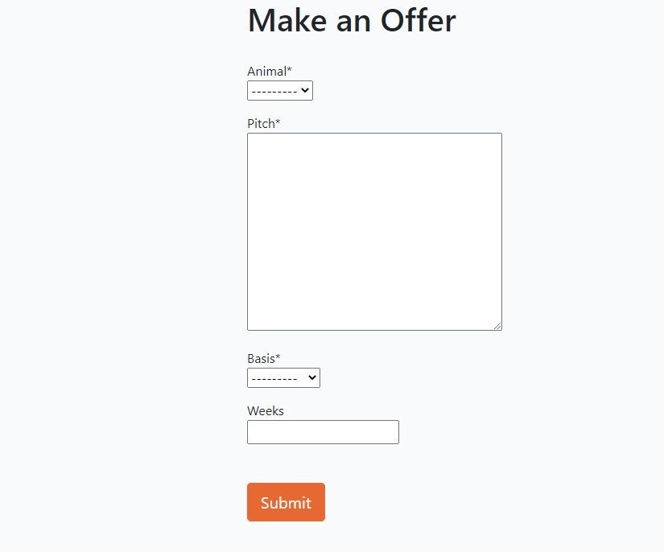

# Animal Hostel

Animal Hostel is a website that enables people to offer a home to a homeless animal. The home page shows photos of the animals currently at the hostel as well as a short
description of what the website is about. Users can browse the curent occupancy but to make an offer they need to register and login. Once logged in they can view, edit or delete their offers as well as see the status of the offers. They can also specify whether their interest is in fostering or adopting. The goal of the site is to find owners
 for these poor unfortunate homeless animals. The administrator can add and maintain the animals and approve or reject the offers.

## Site Owners Goals
* The site looks good visually.
* The site is responsive.
* The site is accessible.
* The site is eaily navigable.
* The site displays the animals at the hostel.
* The site provides the means for users to offer homes for the animals.

## Site Administrators Goals
* To be able to add and maintain a list of animals.
* To be able to approve or reject offers made.
* To be able to maintain the animal types.

## Users Goals
* To find the site interesting and useful.
* To find the site easy to use.
* To be able to view the animals looking for homes.
* To be able to offer a home to a particular animal.
* To be able to specify my interest in fostering vs adoption.
* To be able to see the status of my offers. 

## User Stories
* Rotating image display: As a site owner I want the home page to display a rotating image of each animal so users will find the site interesting.  
* Site description: As a site owner I want the home page to explain its purpose so users will immediately get it.

* View guest list: As a Site User I can view a list of animals so that I can select one to take home.
* Filter on category: As a Site User I can filter the list of animals so that I can see only the relevant ones.
* See detailed view of animal: As a Site User I can click on a guest so that I can read the full details about them.

* Account registration: As a Site User I can register an account so that I can make offers on animals.
* Make an offer: As a Site User I can make an offer to a guest so that I can give them a home.
* View my offers: As a Site User I can see my offers so that I can see the status of each one.
* Edit my offers: As a Site User I can edit my offers so that I can change the details.
* Delete my offers: As a Site User I can delete my offers so that I can resend my offer.

* Manage guest list: As a Site Admin I can add, view, update and delete animals so that I can maintain the list.
* Manage animal type list: As a Site Admin I can add, view, update and delete animal types so that I can maintain them.
* Approve offers: As a Site Admin I can approve or reject offers so that I can find the right home for each guest.

## Wireframes
The wireframes below were generated using [Balsamic](https://balsamiq.com/wireframes/ "Balsamic"). 

### [Navbar - Desktop and Phone](docs/wireframes/navbar.png "Navbar wireframe")
### [Footer - Desktop and Phone](docs/wireframes/footer-desktop-and-phone.png "Footer wireframe")
### [Home - Desktop - Not signed in](docs/wireframes/home-desktop-not-signed-in.png "Home Desktop not signed in wireframe")
### [Home - Desktop - Signed in](docs/wireframes/home-desktop-signed-in.png "Home Desktop signed in wireframe")
### [Home - Phone](docs/wireframes/home-phone.png "Home Phone wireframe")
### [Animal Detail View - Desktop](docs/wireframes/detail-view-desktop.png "View Animal Detail Desktop wireframe")
### [Animal Detail View - Phone](docs/wireframes/detail-view-phone.png "View Animal Detail Phone wireframe") 
### [Register](docs/wireframes/register.png "Registration wireframe")
### [Sign-In](docs/wireframes/sign-in.png "Sign IN wireframe")
### [Offers - Desktop](docs/wireframes/offers-desktop.png "Offers wireframe")
### [Add Offer - Desktop](docs/wireframes/add-offer-desktop.png "Add Offer - Desktop wireframe")
### [Add Offer - Phone](docs/wireframes/add-offer-phone.png "Add Offer - Phone wireframe")     
### Django Administration Screens
#### [Animal](docs/wireframes/django-adimistration-animal.png "Animal wireframe")
#### [Offer](docs/wireframes/django-administration-offer.png "Offer wireframe")
&nbsp;  

## Entity Relationship Diagram
This diagram was created using [SmartDraw](https://www.smartdraw.com/entity-relationship-diagram/er-diagram-tool.htm "SmartDraw"). 
### [Models](docs/erd.jpg "Models")                       
&nbsp;  

## Features 

### Existing Features

### Make an Offer
This page allows the user to make/add an offer for an animal or guest. 
- The current guests are listed in the dropdown for animal.
- The pitch area allows users an opportunity to convince the administrator that they over the best home of this animal.
- The basis field offers a choice of Adoption or Fostering.
- The weeks field is optional but should be entered for fostering to indicate how long the user would be prepared to foster for.
- The submit button adds the offer to the database.

### Features Left to Implement
- A means of allowing users to donate to the hostel.

## Technologies used

### Languages
* HTML
* CSS
* Python

### Libraries & Framework
* Django

### Tools
* [Balsamic](https://balsamiq.com/wireframes/ "Balsamic")
* Google Fonts

## Testing 
- The complete testing details are contained [here](docs/testing/testing.md "testing").    
- During testing I discovered that my development db.sqlite3 database had been accidentally pushed to github.     
  I immediately added it into .gitignore to prevent this re-ocurring, removed it from github using the git rm -r --cached *.sqlite3 command,    
  commited and pushed this to github/heroku and recycled the API Keys. 

### Validator Testing 

### Unfixed Bugs

## Deployment
- The complete deployment details are contained [here](docs/deployment.md "deployment").       

## Credits 
* [Simen Daehlin](https://github.com/Eventyret "Simen Daehlin") for code inspiration, help and advice.
* [Stack Overflow](https://stackoverflow.com/ "Stack Overflow") for help and assistance.
* [Code Institute Open Source Project](https://github.com/Code-Institute-Community/business-analysis-project/ "Code Institute Open Source Project") for inspiration for the pull request template.
* [Code Institute](https://codeinstitute.net/ie/ "Code Institute") for the starter templates and help and inspiration from the run through projects. 

### Content 

### Media
