# Animal Hostel

Animal Hostel is a website that enables people to offer a home to a homeless animal. The home page shows photos of the animals currently at the hostel as well as a short
description of what the website is about. Users can browse the current occupancy but to make an offer they need to register and log in. Once logged in they can view, edit or delete their offers as well as see the status of the offers. They can also specify whether their interest is in fostering or adopting. The goal of the site is to find owners
for these poor unfortunate homeless animals. The administrator can add and maintain the animals and approve or reject the offers.

 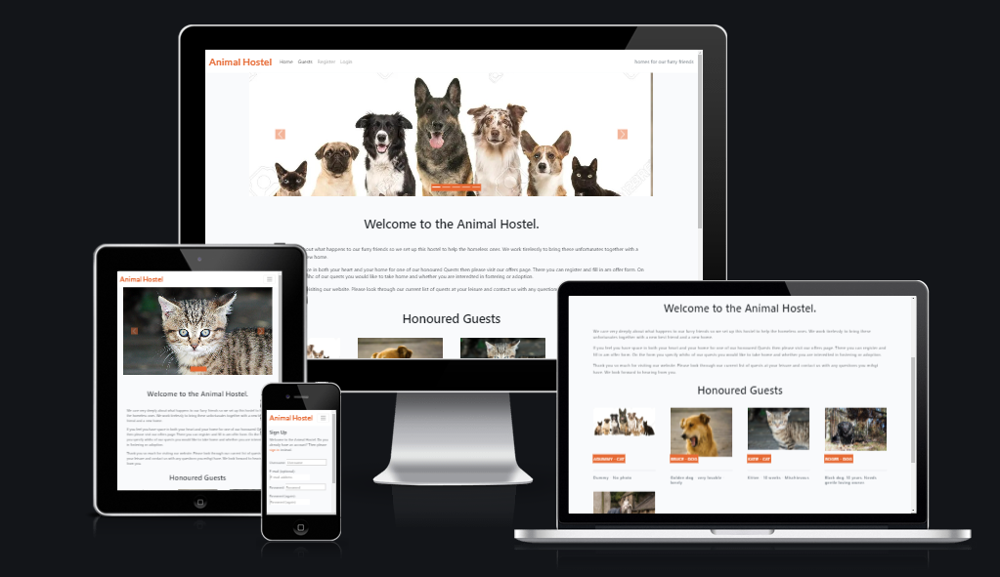 

## Site Owner’s Goals
* The site looks good visually.
* The site is responsive.
* The site is accessible.
* The site is easily navigable.
* The site displays the animals at the hostel.
* The site provides the means for users to offer homes for the animals.

## Site Administrator’s Goals
* To be able to add and maintain a list of animals.
* To be able to approve or reject offers made.
* To be able to maintain the animal types.

## Users Goals
* To find the site interesting and useful.
* To find the site easy to use.
* To be able to view the animals looking for homes.
* To be able to offer a home to a particular animal.
* To be able to specify my interest in fostering vs adoption.
* To be able to see the status of my offers. 

## User Stories
### As a site owner 
* I want the home page to display a rotating image of each animal so users will find the site interesting.  
* I want the home page to explain its purpose so users will immediately get it.

### As a site user 
* I can view a list of animals so that I can select one to take home.
* I can filter the list of animals so that I can see only the relevant ones.
* I can click on a guest so that I can read the full details about them.
* I can register an account so that I can make offers on animals.
* I can make an offer to a guest so that I can give them a home.
* I can see my offers so that I can see the status of each one.
* I can edit my offers so that I can change the details.
* I can delete my offers so that I can rescind my offer.

### As a site administrator
* I can add, view, update and delete animals so that I can maintain the list.
* I can add, view, update and delete animal types so that I can maintain them.
* I can approve or reject offers so that I can find the right home for each guest.

## Wireframes
The wireframes below were generated using [Balsamic](https://balsamiq.com/wireframes/ "Balsamic"). 

### [Navbar - Desktop and Phone](docs/wireframes/navbar.png "Navbar wireframe")
### [Footer - Desktop and Phone](docs/wireframes/footer-desktop-and-phone.png "Footer wireframe")
### [Home - Desktop - Not signed in](docs/wireframes/home-desktop-not-signed-in.png "Home Desktop not signed in wireframe")
### [Home - Desktop - Signed in](docs/wireframes/home-desktop-signed-in.png "Home Desktop signed in wireframe")
### [Home - Phone](docs/wireframes/home-phone.png "Home Phone wireframe")
### [Animal Detail View - Desktop](docs/wireframes/detail-view-desktop.png "View Animal Detail Desktop wireframe")
### [Animal Detail View - Phone](docs/wireframes/detail-view-phone.png "View Animal Detail Phone wireframe") 
### [Register](docs/wireframes/register.png "Registration wireframe")
### [Sign-In](docs/wireframes/sign-in.png "Sign IN wireframe")
### [Offers - Desktop](docs/wireframes/offers-desktop.png "Offers wireframe")
### [Add Offer - Desktop](docs/wireframes/add-offer-desktop.png "Add Offer - Desktop wireframe")
### [Add Offer - Phone](docs/wireframes/add-offer-phone.png "Add Offer - Phone wireframe")     
### Django Administration Screens
#### [Animal](docs/wireframes/django-adimistration-animal.png "Animal wireframe")
#### [Offer](docs/wireframes/django-administration-offer.png "Offer wireframe")
&nbsp;  

## Entity Relationship Diagram
This diagram was created using [SmartDraw](https://www.smartdraw.com/entity-relationship-diagram/er-diagram-tool.htm "SmartDraw"). 
### 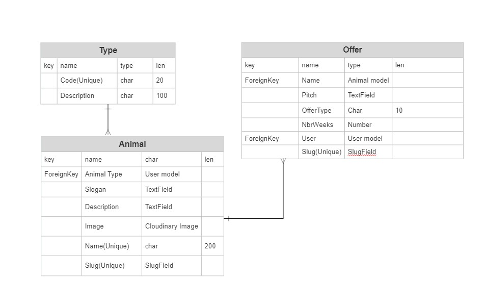    
&nbsp;  

## Models

### Animal Type

| Code        | models.CharField(max_length=20, unique=True |
|-------------|---------------------------------------------|
| Description | models.CharField(max_length=100)            |

### Animal 

| Name        | models.CharField(max_length=200, unique=True)           |
|-------------|---------------------------------------------------------|
| Slug        | models.SlugField(max_length=200, unique=True)           |
| Type        | models.ForeignKey(AnimalType, on_delete=models.CASCADE) |
| description | models.TextField()                                      |
| image       | CloudinaryField('image', default='placeholder')         |
| slogan      | models.TextField(blank=True)                            |

### Offer

| slug   | models.CharField(max_length=200, unique=True)                                   |
|--------|---------------------------------------------------------------------------------|
| animal | models.ForeignKey(Animal, on_delete=models.CASCADE)                             |
| user   | models.ForeignKey(User, on_delete=models.CASCADE                                |
| basis  | basis = models.CharField(max_length=1, choices=('Adoption','Fostering')         |
| pitch  | models.TextField()                                                              |
| weeks  | models.PositiveSmallIntegerField(null=True, blank=True)                         |
| status | status = models.CharField(max_length=1,choices=('Aproved','Pending','Rejected') |

## Design Choices

### Fonts
I wanted my site to have a simple clean look where the photos of the animals could dominate.
Therefore I decided to use a basic san-serif font for the text and just use the [Lato](https://fonts.google.com/specimen/Lato "Lato") for the brand name.

### Icons
I decided to use icons from [Font Awesome](https://fontawesome.com/icons "Font Awesome") where necessary to indicate easily recognizable functions like delete and    
for social media.

### Colours
I decided to keep the website mostly white with light grey backgrounds so the photos could focus the eye but I also wanted one stand-out colour that popped    
and brought the website together so I choose a peppy orange colour for this. I am using the standard bootstrap dark grey colour for most of the text which is white on coloured backgrounds to stand out. Buttons and links use the orange colour.     
Below is the pallet which I generated using [Colormind](http://colormind.io/ "Colormind"). 

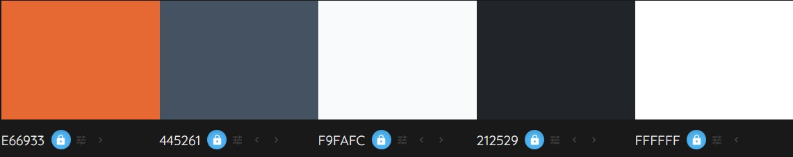

## Features 

The site consists of a home page featuring a Carousel of photos and a list of honoured guests.
There is a login and register page so users can sign-up and login and a logout page.
The animal administration is available via the django administration screens where animals can be maintained.
Once signed in the My Offers page becomes available from where users can view, add, edit and delete their own offers.

### Existing Features

### Navigation Bar
- Featured at the top of the page, the fully responsive navigation bar includes links to the available pages.
- If signed in the available links are Home, Guests, My Offers and Logout.
- If signed in the available links are Home, Guests, Register and Login.
- Also, if signed in the user name appears on the right of the navigation bar.
- If not signed in the site mission appears on the right instead. 
- On small screens the navigation bar appears as a hamburger icon which expands when clicked.

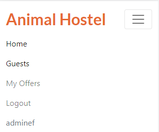 

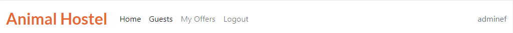   

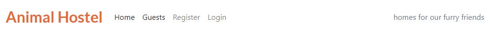    

### Carousel

- Featured on the home page just under the navigation
- It loops through the images loaded for each guest displaying them
- The indicators show the position of the current photo in the list 
- The controls can be used to move forward or back through the list.
- Where no photo is loaded a placeholder photo is shown instead.

 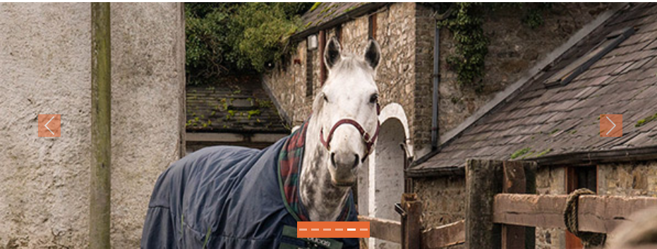

 ### Site Description
 - Some text describing what the site is about.

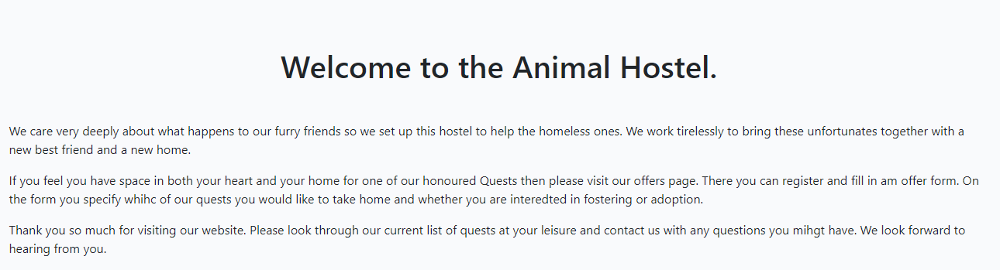

### Guest List
- Card representation of each animal featuring a photo, Name, Type, and slogan

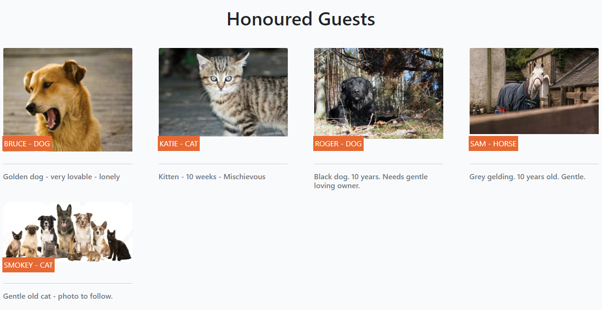

### Link to offers
- Link to offers if signed in and to register if not.

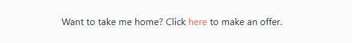    
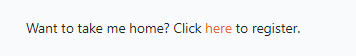    
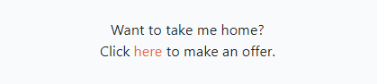    

### Guest Details page
- Displays heading with animal name, slogan and photo
- Displays a larger description also.

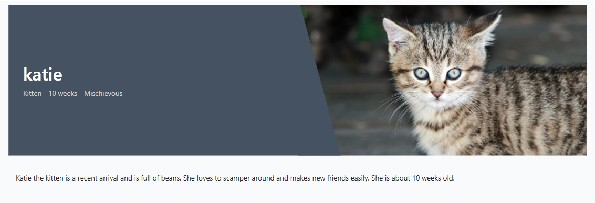    
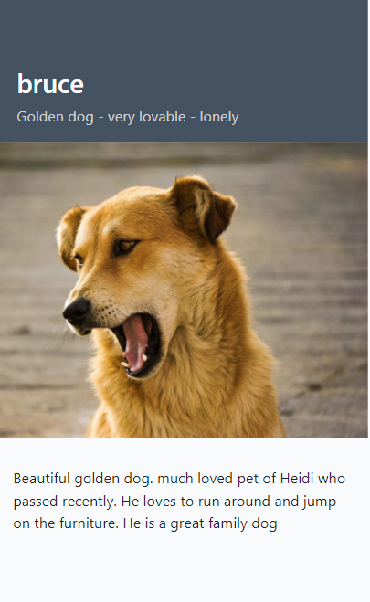  

### My Offers page
- Displays offers for that user only. Name is a link to edit offer. Appears orange on hovering.

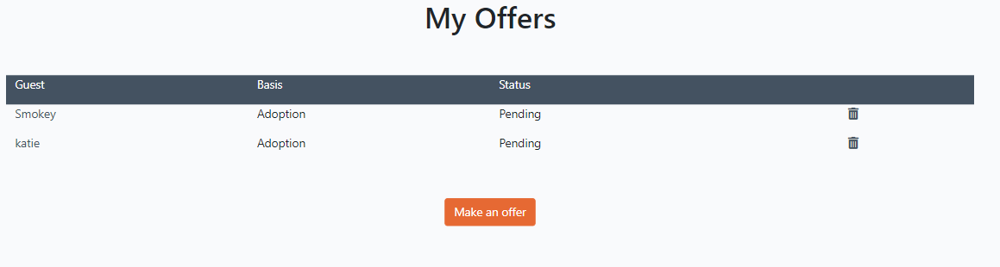    

### Make an Offer
This page allows the user to make/add an offer for an animal or guest. 
- The current guests are listed in the dropdown for animal.
- The pitch area allows users an opportunity to convince the administrator that they over the best home of this animal.
- The basis field offers a choice of Adoption or Fostering.
- The weeks field is optional but should be entered for fostering to indicate how long the user would be prepared to foster for.
- The submit button adds the offer to the database.

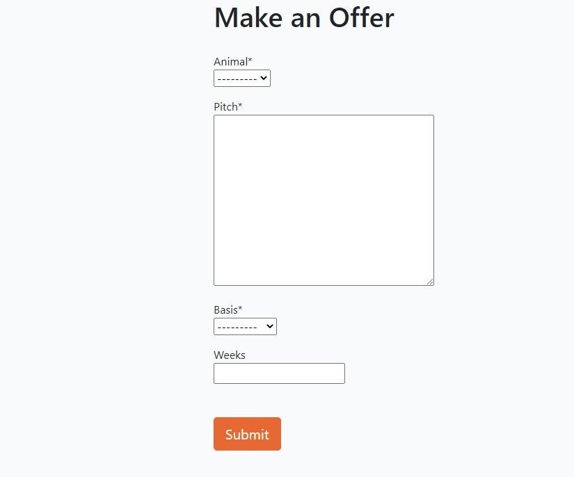
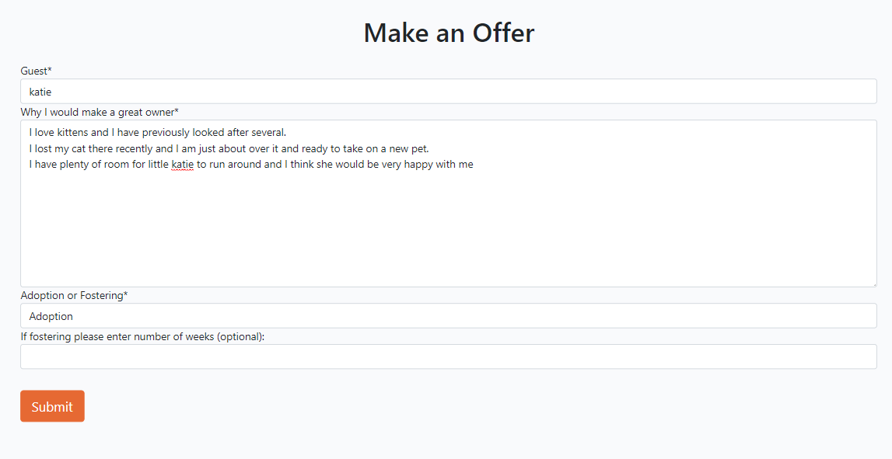

### Edit Offer page
- Displays details for the offer and allows them to be changed. Save button saves changes to database.

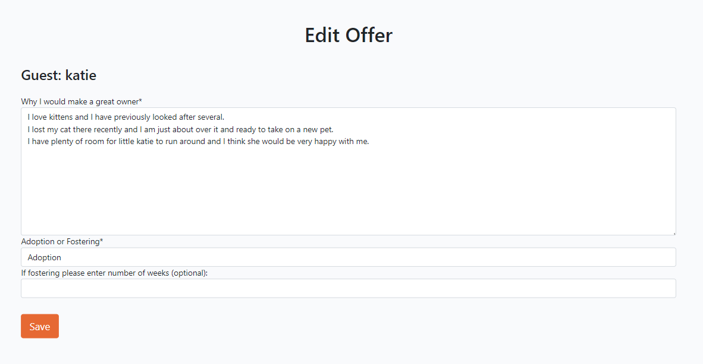 
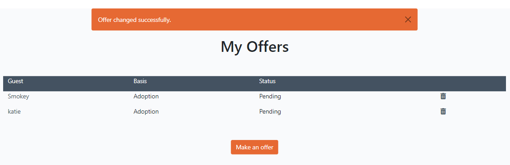    
   
### Delete Offer page
- Displays details for the offer and allows them to be deleted. Delete button deletes from the database.

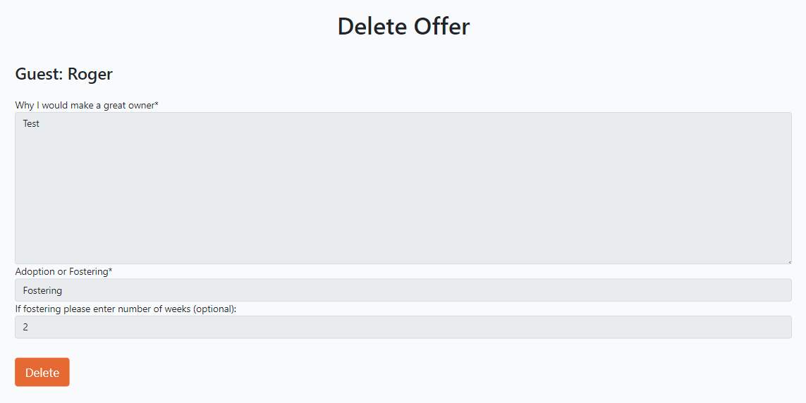 
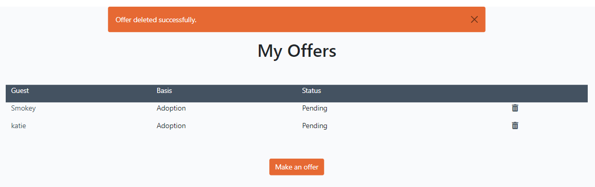    

### Footer
- Displays copyright details, the address and phone number and the social media icons.

 
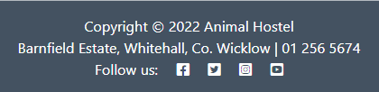    

### Django Admin functionality
- Animal types, animals and offers can be administered from the django admin screen.
- Offers can be given a status here.

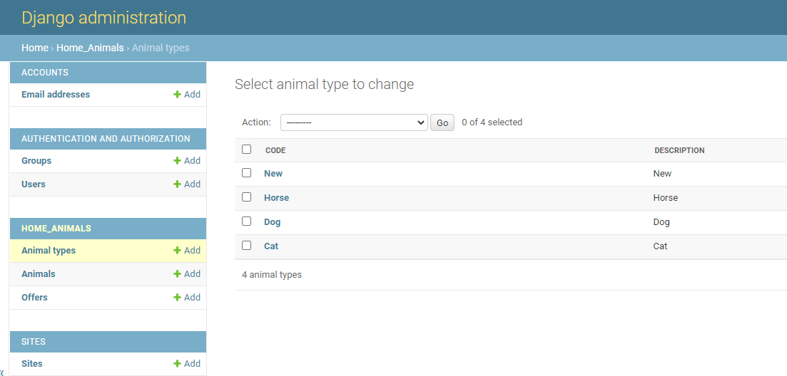 
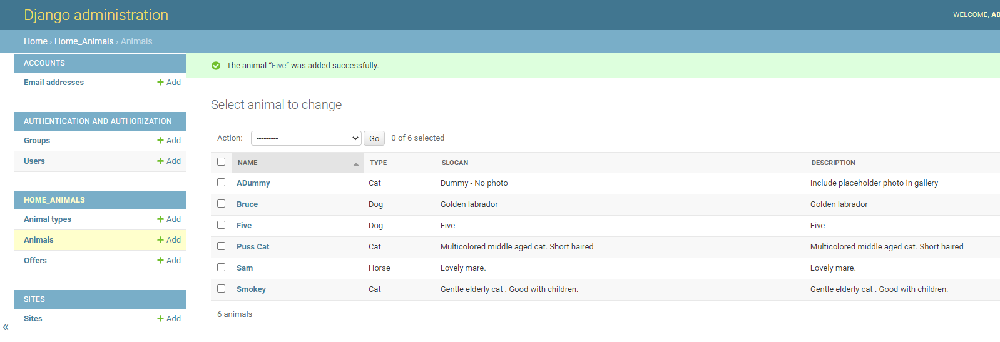    
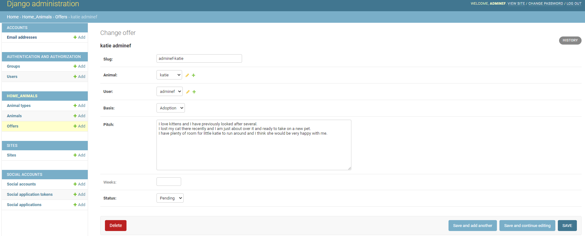  

### Features Left to Implement
- A means of allowing users to donate to the hostel.
- USER STORY: Filter on category #4
- It would be preferable to have a separate page implemented for the administrator functions 
  where they can maintain the types and animals and set the status of offers without having 
  to use the django administration screens.
- It would be nice to be able to filter on other sub categories also like small dogs or older cats.
- It would also be nice to sign up for an email alert if certain animals of interest to a user get added.

## Technologies used

### Languages
* HTML
* CSS
* Python

### Libraries & Framework
* Django

### Tools
* [Balsamic](https://balsamiq.com/wireframes/ "Balsamic")
* [Google Fonts](https://fonts.google.com/ "Google Fonts")
* [Font Awesome](https://fontawesome.com/ "Font Awesome icons" )

## Testing 
- The complete testing details are contained [here](docs/testing.md "testing").    
- During testing I discovered that my development db.sqlite3 database had been accidentally pushed to github.     
  I immediately added it into .gitignore to prevent this re-occurring, removed it from github using the `git rm -r --cached *.sqlite3` command,    
  committed and pushed this to github/heroku and recycled the API Keys. 
- The results of running my automatic tests are [here](docs/images/AutomaticTests.jpg "tests")
- The branches created for this implementation have not been deleted as they normally would to demonstrate their use in the project.

### Validator Testing 
- HTML
  - No errors were returned when passing through the official [W3C validator](https://validator.w3.org/nu/?doc=https%3A%2F%2Fanimals-hostel.herokuapp.com%2F)
  - See [Results](docs/images/html-validator-index.png)
- CSS
  - No errors were found when passing through the official [(Jigsaw) validator](https://jigsaw.w3.org/css-validator/validator?uri=https%3A%2F%2Fanimals-hostel.herokuapp.com%2F&profile=css3svg&usermedium=all&warning=1&vextwarning=&lang=en)
  - See [Results](docs/images/css-validator.png)
- Lighthouse Report
    - Accessibility score 94
    - See [Results](docs/images/lighthouse-result.png)

### Unfixed Bugs
- If you register and specify an email you will receive two flash messages only one of which disappears.

## Deployment
- The complete deployment details are contained [here](docs/deployment.md "deployment").       

## Credits 
* [Simen Daehlin](https://github.com/Eventyret "Simen Daehlin") for code inspiration, help and advice.
* [Stack Overflow](https://stackoverflow.com/ "Stack Overflow") for help and assistance.
* [Code Institute Open Source Project](https://github.com/Code-Institute-Community/business-analysis-project/ "Code Institute Open Source Project") for inspiration for the pull request template.
* [Code Institute](https://codeinstitute.net/ie/ "Code Institute") for the starter templates and help and inspiration from the run through projects. 

### Content 
- The content is all made up.

### Media
[Roger](https://libreshot.com/lying-black-dog/ "Roger")    
[Katie](https://stocksnap.io/photo/animal-face-PP1NWE5XWK "Katie")    
[Bruce](https://www.stockvault.net/photo/191689/pet-dog "Bruce")    
[Sam](https://www.brennanstownrs.ie/ "Sam")    
[Group](https://www.123rf.com/ "Group")    
